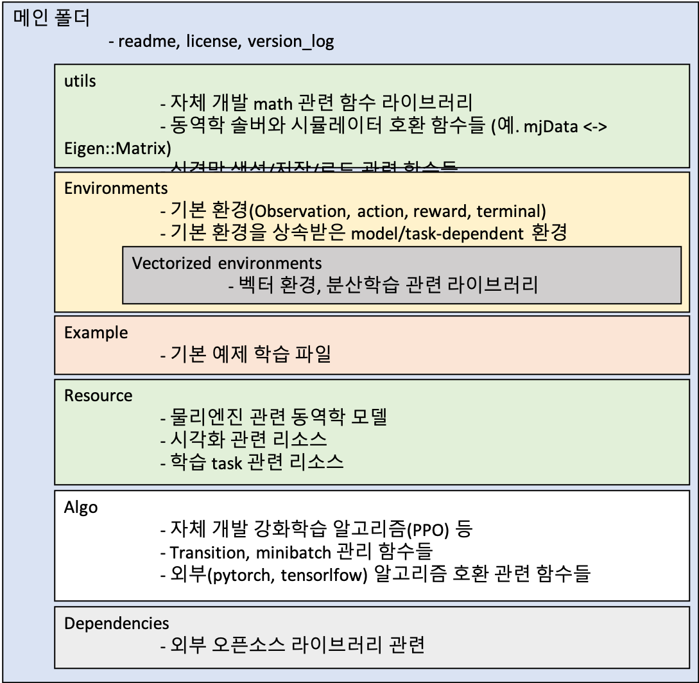

# Reinforcement Learning Simulator

## Overview
This project is a simulator designed for reinforcement learning (RL) experiments. It integrates physics engines (such as MuJoCo) to provide diverse environments for training RL agents. The project includes features for setting up environments, implementing RL algorithms, and visualizing results.

---

## Project Structure
The following is an overview of the main folders and their functionalities:



### 1. Algo
- **Purpose**: Contains the implementation of RL algorithms (e.g., PPO) and utilities for managing transitions and minibatches.
  - Includes core functions for training algorithms.
  - Provides compatibility with external frameworks like PyTorch and TensorFlow.

### 2. Dependencies
- **Purpose**: Contains dependency-related files.
  - Includes `requirements.txt` for listing all necessary libraries and dependencies.

### 3. Environments
- **Purpose**: Defines and manages RL environments.
  - Implements core environment components such as Observation, Action, Reward, and Termination.
  - Supports task-specific and model-dependent environments.
  - Enables vectorized environments and extensions for distributed learning.

### 4. Examples
- **Purpose**: Provides example scripts for running RL experiments.
  - Includes sample implementations of training scripts (e.g., PPO, DQN).

### 5. Resource
- **Purpose**: Stores resources related to RL environments.
  - Physics engine model files and visualization assets.
  - Data files for task-specific learning.

### 6. Utils
- **Purpose**: Utility functions to support the project.
  - Mathematical operations and conversion functions for compatibility with physics engines (e.g., MuJoCo).
  - Functions for saving/loading neural network models.

---

## Installation and Execution

### 1. Install Required Libraries
Install dependencies using the following command:
```bash
pip install -r requirements.txt
