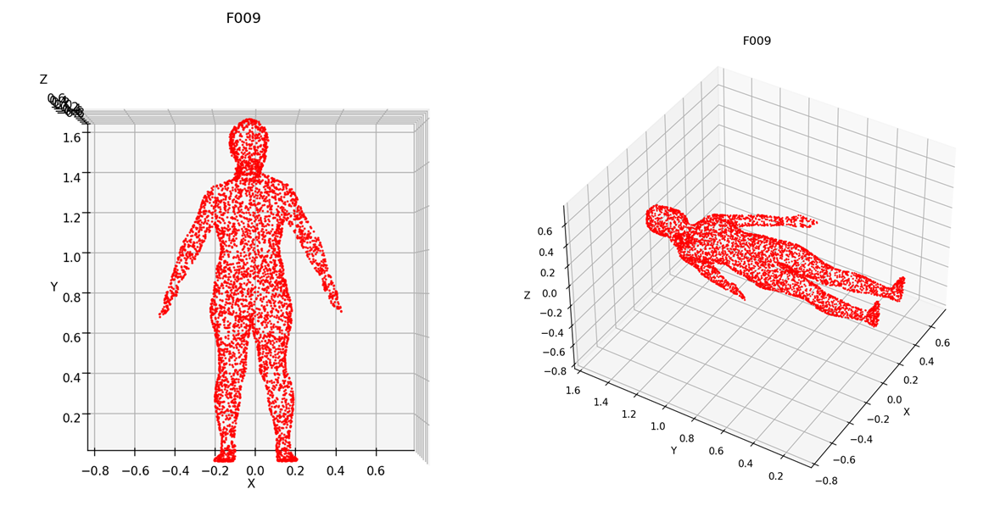

# **Utils**

## **Overview**
The `utils` folder contains utility scripts and functions that support the core functionality of the reinforcement learning simulator. These utilities are designed to streamline processes such as creating neural network architectures, handling file operations, and performing mathematical computations.

---

## **Files in this Folder**

### **1. net_generator.py**
- **Purpose**: Provides a flexible way to define neural network architectures with customizable layers and activation functions.
- **Key Functions**:
  1. `create_network(input_dim, output_dim, hidden_layers, activation_fn)`:
      - Dynamically generates a neural network using the specified input size, output size, hidden layers, and activation function.
      - **Parameters**:
        - `input_dim` (int): Number of input features.
        - `output_dim` (int): Number of output features.
        - `hidden_layers` (list): A list of integers specifying the number of neurons in each hidden layer.
        - `activation_fn` (callable): The activation function applied to each layer.
      - **Returns**:
        - A PyTorch `nn.Sequential` model.
  2. `get_activation_fn(name)`:
      - Retrieves the specified activation function from a predefined set.
      - **Supported Activations**:
        - `ReLU`
        - `LeakyReLU`
        - `Tanh`
        - `Sigmoid`

### **2. vis_human3.py**
- **기능**: **AIHub**의 한국인 전신 형상 및 치수 측정 데이터(.obj)를 볼 수 있는 기능
- **Key Functions**:

---

## **Usage Example**
### Creating a Neural Network
```python
from net_generator import create_network, get_activation_fn

# Define network parameters
input_dim = 4
output_dim = 2
hidden_layers = [64, 32]
activation_fn = get_activation_fn("ReLU")

# Create the network
network = create_network(input_dim, output_dim, hidden_layers, activation_fn)
print(network)